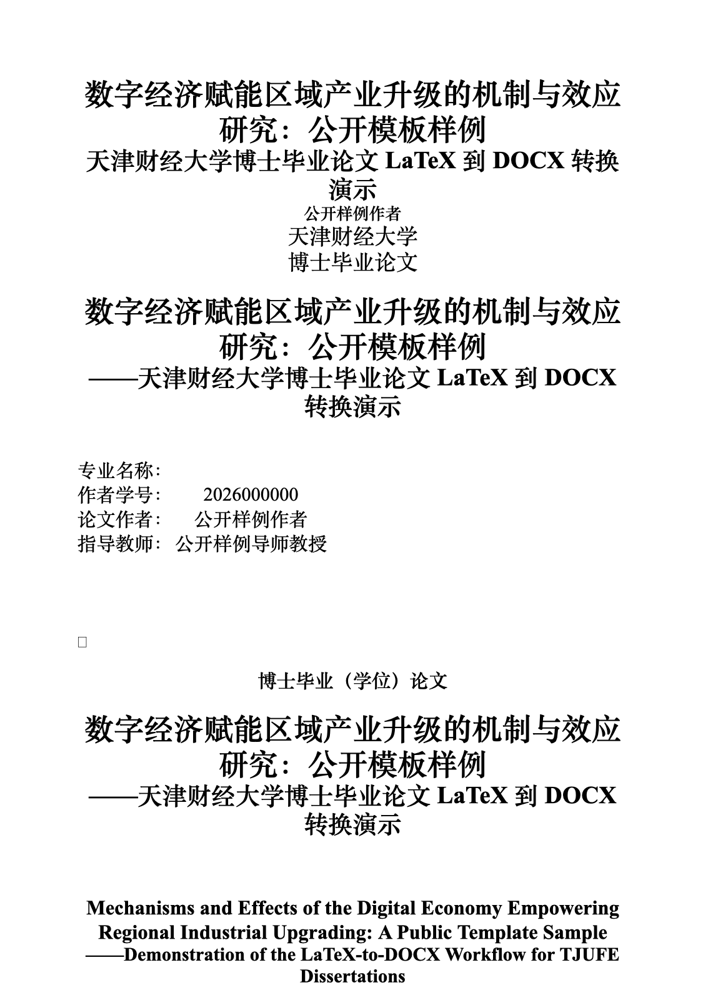

# 天津财经大学博士毕业论文模板：tjufe-latex-docx-pandoc

面向天津财经大学研究生毕业（学位）论文格式的 **LaTeX → Word DOCX** 转换工具链。

本项目的目标不是替代 Word/WPS 的最终人工检查，而是把 LaTeX 论文源文件尽可能稳定地转换成符合天津财经大学管理学研究生毕业（学位）论文格式要求的 DOCX 初稿，并把封面、扉页、摘要、目录、正文、图表、公式、参考文献、附录、后记等结构性与样式性工作自动化。

> 生成声明：本项目完全由 OpenClaw 以及 GPT-5.4 完成，包括工具链整理、公开样例生成、README 编写与发布流程。

> 隐私声明：本仓库是公开模板和工具链，不包含真实论文正文、真实数据、真实参考文献库、个人日志或私有凭据。`samples/` 中的内容均为公开占位样例。

## 项目适用范围

本仓库当前主要围绕以下规范和目标实现：

- 规范原文：[`docs/tjufe-management-thesis-format-spec.docx`](docs/tjufe-management-thesis-format-spec.docx)
- 逐条对照报告：[`docs/spec-vs-implementation-management-full-clause.md`](docs/spec-vs-implementation-management-full-clause.md)
- 目标输出：天津财经大学研究生毕业（学位）论文 DOCX 初稿
- 输入形式：LaTeX 论文源文件 + YAML 元数据
- 输出形式：可在 Word/WPS 中继续人工终检和编辑的 `.docx`

如果你的学院、学科、年份或导师要求与管理学规范不同，请以你实际适用的官方文件为准，并对脚本参数和样式进行相应调整。

## 核心功能

- 将 LaTeX 论文源文件转换为 Word DOCX。
- 根据元数据生成或整理封面、扉页、中文摘要、英文摘要、目录、正文、附录、后记等结构。
- 通过 `reference.docx` 提供 Word 样式基线。
- 通过 Lua filter 在 Pandoc 阶段处理论文结构、标题、图表、公式和交叉引用标记。
- 通过 Python 后处理 DOCX 的 OOXML，补强 Pandoc 默认导出的不足。
- 对输出 DOCX 执行审计扫描，提示常见格式风险。
- 提供完整公开样例和已生成的 `samples/sample.docx`，便于快速查看效果。
- 提供规范原文与脚本实现之间的全文逐条对照报告，便于理解哪些要求已经自动化、哪些仍需人工终检。

## 转换链路

整体流程如下：

```text
LaTeX 源文件
  ↓
scripts/preprocess_tjufe_tex.py
  ↓
pandoc + filters/tjufe-thesis.lua + reference.docx
  ↓
临时 raw.docx
  ↓
scripts/postprocess_tjufe_docx.py
  ↓
最终 output.docx
  ↓
convert_tjufe.sh 内置审计扫描
```

各部分职责：

1. `convert_tjufe.sh`
   - 主入口脚本。
   - 解析输入、输出、metadata 和额外 Pandoc 参数。
   - 自动查找 metadata。
   - 调用预处理、Pandoc、Lua filter、DOCX 后处理和审计扫描。

2. `scripts/preprocess_tjufe_tex.py`
   - 在 Pandoc 前对 LaTeX 源进行轻量预处理。
   - 目标是降低复杂 LaTeX 写法对 Pandoc 的转换干扰。

3. `filters/tjufe-thesis.lua`
   - Pandoc Lua filter。
   - 处理论文结构、章节、摘要、关键词、图表、公式、交叉引用等中间表示。

4. `scripts/build_reference_docx.py`
   - 生成 `reference.docx`。
   - 定义页面、页边距、正文、标题、摘要、脚注、参考文献等 Word 样式基线。

5. `scripts/postprocess_tjufe_docx.py`
   - 在 OOXML 层二次修正 Pandoc 生成的 DOCX。
   - 处理页眉页脚、页码分节、目录域、图表题注、三线表、公式编号、脚注编号、交叉引用、段落样式等。

## 目录结构

```text
.
├── convert_tjufe.sh                         # 主转换入口
├── reference.docx                           # Pandoc reference DOCX 样式基线
├── filters/
│   └── tjufe-thesis.lua                     # Pandoc Lua filter
├── scripts/
│   ├── build_reference_docx.py              # 生成 reference.docx
│   ├── preprocess_tjufe_tex.py              # LaTeX 预处理
│   └── postprocess_tjufe_docx.py            # DOCX 后处理与 OOXML 修正
├── samples/
│   ├── sample-thesis.tex                    # 公开占位 LaTeX 样例
│   ├── sample-metadata.yaml                 # 样例元数据
│   └── sample.docx                          # 已生成的公开样例 DOCX
├── assets/
│   └── sample.docx.png                      # 样例预览图
├── docs/
│   ├── tjufe-management-thesis-format-spec.docx
│   └── spec-vs-implementation-management-full-clause.md
├── out/                                     # 默认输出目录，已被 .gitignore 忽略
├── .gitignore
├── LICENSE
└── README.md
```

## 依赖环境

建议环境：macOS 或 Linux shell。

必需工具：

- `bash`
- `pandoc`
- `python3`
- Python 包：`python-docx`、`lxml`

可选工具：

- Word 或 WPS：用于最终人工检查与更新目录域。
- LaTeX 环境：如果你还需要从 LaTeX 生成 PDF，可另行配置；本工具链主要依赖 Pandoc 解析 LaTeX 输入。

macOS 示例安装：

```bash
brew install pandoc
python3 -m pip install python-docx lxml
```

## 快速开始

克隆仓库后，先给入口脚本执行权限：

```bash
chmod +x convert_tjufe.sh
```

使用公开样例生成 DOCX：

```bash
./convert_tjufe.sh samples/sample-thesis.tex out/sample.docx samples/sample-metadata.yaml
```

输出文件：

```text
out/sample.docx
```

`out/` 是临时输出目录，已被 `.gitignore` 排除，不建议提交真实论文导出结果。

仓库也提供了一个已生成的公开示例：

```text
samples/sample.docx
```

## 命令格式

基本格式：

```bash
./convert_tjufe.sh <input.tex> <output.docx> [metadata.yaml] [extra pandoc args...]
```

示例：

```bash
./convert_tjufe.sh thesis.tex out/thesis.docx metadata.yaml
```

如果不显式传入 metadata，脚本会尝试在输入文件所在目录自动查找：

```text
metadata.yaml
metadata.yml
<input-basename>.yaml
<input-basename>.yml
```

只扫描已有 DOCX：

```bash
./convert_tjufe.sh --scan-docx out/sample.docx samples/sample-metadata.yaml
```

## Metadata 示例

`metadata.yaml` 用于补充封面、扉页、摘要、关键词等信息。公开样例见：

```text
samples/sample-metadata.yaml
```

典型字段包括：

```yaml
title: "数字经济背景下企业创新效率研究"
subtitle: "基于公开占位数据的示例分析"
author: "张三"
student_id: "2023000000"
school: "商学院"
major: "工商管理"
advisor: "李四 教授"
degree_type: "博士毕业（学位）论文"
chinese_keywords:
  - 数字经济
  - 企业创新
  - 管理学
english_keywords:
  - digital economy
  - firm innovation
  - management
```

请根据脚本和样例中实际支持的字段调整你的 metadata。真实论文项目中不要把包含个人信息的 metadata 提交到公开仓库。

## 样例 DOCX 预览

下图由 `samples/sample.docx` 渲染而来，仅使用公开占位内容，不包含真实论文正文或个人信息。



## 规范与实现对照

本项目附带两份文档，帮助理解脚本目标和实现边界：

1. 官方规范原文 DOCX
   - [`docs/tjufe-management-thesis-format-spec.docx`](docs/tjufe-management-thesis-format-spec.docx)
   - 来源：天津财经大学管理学研究生毕业（学位）论文编写规范。

2. 全文逐条对照报告
   - [`docs/spec-vs-implementation-management-full-clause.md`](docs/spec-vs-implementation-management-full-clause.md)
   - 内容：把规范正文逐条拆解，并对照本仓库核心脚本的实现状态。

对照报告中的判定标签包括：

- 已实现：脚本中已有明确实现证据。
- 部分实现：有实现，但与规范字面值不完全一致，或只覆盖部分场景。
- 未实现：在核心脚本中未见明确实现证据。
- 不属于脚本范围：属于内容撰写、学术要求、印刷装订或人工流程要求。
- 需人工终检：脚本已尽量处理，但最终仍需在 Word/WPS 成品中人工确认。

## 已自动化的典型项目

当前工具链重点覆盖：

- 页面与页边距基线。
- 正文、标题、摘要、关键词、参考文献、脚注等主要样式。
- 封面、扉页、摘要、目录、正文、附录、后记等结构顺序。
- 章节标题和多级标题处理。
- 页眉页脚与页码分节。
- 目录域插入。
- 图、表、公式编号。
- 交叉引用书签与引用文本。
- 三线表相关 OOXML 后处理。
- 脚注编号和脚注样式。
- 常见导出风险的审计告警。

## 仍需人工终检的项目

由于 Word/WPS 渲染、学校细则和具体论文内容具有差异，以下项目不应完全依赖脚本自动判断：

- 目录域是否已在 Word/WPS 中刷新。
- 页眉“文武线”等视觉效果。
- 复杂表格跨页、续表、续图的最终视觉观感。
- 图题、表题、表注、图注在特殊排版场景下的位置。
- 公式段落的真实视觉松紧。
- 参考文献是否完全符合 GB/T 7714 的复杂细则。
- 学术性内容要求、原创性声明、授权页、签名页、印刷装订要求。
- 学院、导师或当年通知中的额外要求。

建议流程是：脚本生成 DOCX 初稿 → Word/WPS 打开并更新域 → 按官方规范和学院要求人工终检 → 再提交。

## 重新生成 reference.docx

如果修改了样式生成逻辑，可以重新生成参考样式文件：

```bash
python3 scripts/build_reference_docx.py reference.docx
```

然后再重新运行转换：

```bash
./convert_tjufe.sh samples/sample-thesis.tex out/sample.docx samples/sample-metadata.yaml
```

## 隐私与发布建议

如果你基于本仓库处理真实论文，请不要提交以下内容到公开仓库：

- 真实论文正文、章节草稿、评审意见。
- 真实研究数据、实证结果、访谈材料或未公开图表。
- 真实参考文献库中尚未准备公开的条目。
- 真实生成的 DOCX/PDF/日志文件。
- 姓名、学号、导师、联系方式等个人信息。
- 本地绝对路径、API key、token、账号凭据。

建议：

- 把真实论文项目放在私有目录或 private 仓库。
- public 仓库只保留通用脚本、公开占位样例和可公开的规范说明。
- 每次发布前扫描乱码、绝对路径、token 和真实论文内容。

## 常见问题

### 1. 为什么还要人工终检？

因为 DOCX 是复杂的 OOXML 容器，Word/WPS 的最终渲染结果可能受到字体、域更新、页面设置、操作系统和软件版本影响。脚本可以自动化大部分结构和样式，但不能替代最终成品检查。

### 2. 为什么使用 `reference.docx`？

Pandoc 转 DOCX 时会读取 reference DOCX 中的样式定义。通过维护 `reference.docx`，可以稳定控制正文、标题、脚注、参考文献等基础样式。

### 3. 为什么还需要后处理脚本？

Pandoc 默认导出的 DOCX 很难直接满足学校论文规范中的页眉页脚、分节页码、目录域、复杂编号、交叉引用、三线表等要求，因此需要在 OOXML 层继续修正。

### 4. 可以直接用于正式提交吗？

不建议“直接提交”。建议把它作为自动化初稿生成工具。正式提交前应使用 Word/WPS 打开，更新目录和交叉引用，检查页眉页脚、分页、图表、公式、参考文献和学院最新要求。

## License

MIT License. See [`LICENSE`](LICENSE).
